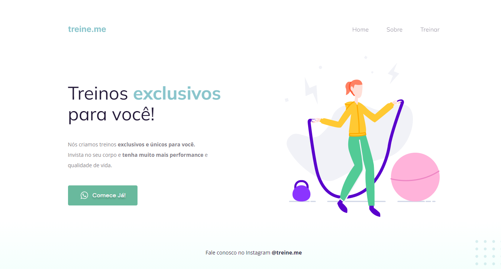

# Projeto-02

[🔗 Clique aqui para acessar](https://victorm-mp.github.io/Projeto-02/)

## Tecnologias 🛠
- HTML
- CSS
- Git e Github

## Descrição 📖
Projeto 2 do Stage 2 do curso Explorer da Rocketseat. Nesse projeto aprendi sobre as tags semânticas do HTML e aprendi a fazer um botão funcional. No CSS, aprendi como funciona o box model, uso básico de flexbox para posicionamento dos elementos utilizando o justify-content e o align-items e também aprendi algumas propriedades de estilização como background, border radius, linear-gradient e também o comportamento de quando se pausa o cursor por cima do elemento(hover).  

## Contato ⭐
victormatheus.mpm@gmail.com

www.linkedin.com/in/victormatheus-mp

 
